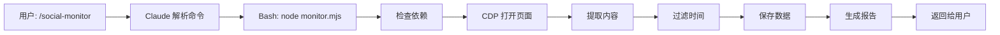
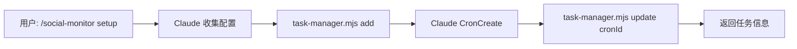

# Social Monitor - 架构设计文档

## 📁 目录结构

```
social-monitor/
├── .claude-plugin/           # Claude Code 插件配置
│   ├── plugin.json          # 插件元数据
│   └── marketplace.json     # 市场展示信息
├── scripts/                 # 核心功能脚本
│   ├── monitor.mjs          # 监控执行脚本
│   ├── task-manager.mjs     # 任务管理脚本
│   └── publish.mjs          # 数据发布脚本
├── data/                    # 数据存储目录
│   └── README.md
├── config.json              # 配置文件
├── SKILL.md                 # Skill 定义（Claude 读取）
├── README.md                # 用户文档
├── QUICKSTART.md            # 快速入门
├── EXAMPLES.md              # 使用示例
├── TEST.md                  # 测试指南
├── setup-feed-repo.sh       # Feed 仓库初始化脚本
└── publish.sh               # 快速发布脚本
```

---

## 🏗️ 核心组件

### 1. monitor.mjs - 监控执行引擎

**职责**：
- 检查依赖（web-access, CDP Proxy）
- 调用 web-access 的 CDP 客户端打开页面
- 执行 JavaScript 代码提取内容
- 过滤时间范围
- 生成报告
- 保存数据

**调用方式**：
```bash
node scripts/monitor.mjs [关键词] [平台] [时间范围]
```

**输出**：
- 标准输出：Markdown 格式报告
- 文件输出：JSON 格式数据（保存到 data/ 目录）

**关键函数**：
- `monitor()` - 主函数
- `checkDependencies()` - 检查依赖
- `fetchWithCDP()` - CDP 模式抓取
- `getExtractScript()` - 获取平台提取脚本
- `filterByTimeRange()` - 时间过滤
- `generateReport()` - 生成报告

**平台适配**：
每个平台有独立的 DOM 提取脚本，返回标准化的数据格式：
```javascript
{
  title: string,
  author: string,
  time: string,
  likes: string,
  link: string,
  platform: string
}
```

### 2. task-manager.mjs - 任务管理器

**职责**：
- CRUD 任务配置
- 生成 CronCreate 提示语
- 记录任务执行历史

**数据存储**：
任务保存在 `config.json` 的 `tasks` 数组中。

**任务结构**：
```json
{
  "id": "task_1234567890",
  "name": "任务名称",
  "keywords": ["关键词1", "关键词2"],
  "platforms": ["xiaohongshu", "weibo"],
  "schedule": "0 9 * * *",
  "timeRange": "24h",
  "cronId": "cron_abc123",
  "enabled": true,
  "createdAt": "ISO时间",
  "lastRun": {
    "time": "ISO时间",
    "success": true,
    "error": null
  }
}
```

**调用方式**：
```bash
# 添加任务
node scripts/task-manager.mjs add <name> <keywords> <platforms> <schedule> <timeRange>

# 列出任务
node scripts/task-manager.mjs list

# 获取任务
node scripts/task-manager.mjs get <taskId>

# 更新任务
node scripts/task-manager.mjs update <taskId> <field> <value>

# 删除任务
node scripts/task-manager.mjs delete <taskId>

# 记录执行
node scripts/task-manager.mjs record <taskId> <success> [error]
```

### 3. publish.mjs - 数据发布器

**职责**：
- 将抓取结果推送到 GitHub 仓库
- 维护订阅索引（index.json）
- 初始化 Feed 仓库

**Feed 仓库结构**：
```
social-monitor-feed/
├── data/
│   ├── index.json              # 更新索引
│   ├── latest.json             # 最新数据
│   └── 2026-04-16_爱奇艺_xiaohongshu.json  # 历史数据
└── README.md
```

**index.json 格式**：
```json
{
  "updates": [
    {
      "date": "2026-04-16",
      "keyword": "爱奇艺",
      "platform": "xiaohongshu",
      "count": 5,
      "file": "2026-04-16_爱奇艺_xiaohongshu.json",
      "timestamp": "ISO时间"
    }
  ]
}
```

**调用方式**：
```bash
# 初始化 Feed 仓库
node scripts/publish.mjs init <github-username>

# 发布数据
node scripts/publish.mjs <data-file-path>
```

---

## 🔄 工作流程

### 流程 1: 手动监控



### 流程 2: 设置定时任务



### 流程 3: 定时执行


---

## 🔌 外部依赖

### 必需依赖

1. **web-access skill**
   - 提供 CDP 客户端（`scripts/cdp-client.mjs`）
   - 需要路径：`~/.claude/skills/web-access/`

2. **Chrome 远程调试**
   - 端口：9222（默认）
   - 启动方式：`/Applications/Google\ Chrome.app/Contents/MacOS/Google\ Chrome --remote-debugging-port=9222`

3. **CDP Proxy** (web-access 提供)
   - 端口：9333（默认）
   - 启动方式：`node ~/.claude/skills/web-access/scripts/cdp-proxy.mjs`

### 可选依赖

1. **GitHub CLI (gh)**
   - 用于自动创建 Feed 仓库
   - 没有时需要手动创建

2. **Git**
   - 用于数据发布到 GitHub

---

## 📊 数据流

### 输入 → 处理 → 输出

```
用户命令
  ↓
解析参数（关键词、平台、时间范围）
  ↓
构建搜索 URL
  ↓
CDP 打开页面
  ↓
执行 JavaScript 提取
  ↓
原始数据（数组）
  ↓
时间过滤
  ↓
标准化数据
  ↓
生成报告（Markdown）
  ↓
保存数据（JSON）
  ↓
可选：发布到 GitHub
```

### 数据格式演变

**1. 网页 DOM → 原始提取**
```javascript
[
  {
    title: "笔记标题",
    author: "作者名1天前",
    link: "https://...",
    likes: "56"
  }
]
```

**2. 时间过滤后**
```javascript
[
  {
    title: "笔记标题",
    author: "作者名",
    time: "1天前",
    link: "https://...",
    likes: "56",
    platform: "xiaohongshu"
  }
]
```

**3. 最终存储格式**
```json
{
  "keyword": "爱奇艺",
  "platform": "xiaohongshu",
  "crawl_time": "2026-04-16T09:00:00+08:00",
  "time_range": "24h",
  "count": 5,
  "items": [...]
}
```

---

## 🛡️ 错误处理策略

### 1. 依赖检查

**位置**: `monitor.mjs` → `checkDependencies()`

**策略**:
- web-access 不存在 → 抛出错误，提示安装
- CDP Proxy 未启动 → 警告但继续（可能仍然成功）

### 2. 页面加载

**位置**: `monitor.mjs` → `fetchWithCDP()`

**策略**:
- 标签页创建失败 → 抛出错误
- 页面加载超时 → 继续尝试提取（可能部分成功）

### 3. 内容提取

**位置**: `monitor.mjs` → `getExtractScript()`

**策略**:
- 提取结果为空 → 返回空数组，报告中说明
- 选择器异常 → try-catch 包裹，跳过失败的项

### 4. 数据发布

**位置**: `publish.mjs`

**策略**:
- Feed 仓库不存在 → 提示运行 init
- Git 推送失败 → 捕获错误，返回详细信息
- 无变更 → 跳过推送，返回 skipped 标志

---

## 🔧 配置系统

### config.json 结构

```json
{
  "version": "1.0.0",
  "defaultKeyword": "爱奇艺",
  "tasks": [],  // 任务列表
  "platforms": {
    "xiaohongshu": {
      "name": "小红书",
      "searchUrl": "https://www.xiaohongshu.com/search_result?keyword={keyword}",
      "enabled": true,
      "requiresLogin": false,
      "useCDP": true
    }
  },
  "settings": {
    "defaultPlatform": "xiaohongshu",
    "defaultTimeRange": "24h",
    "maxResultsPerPlatform": 50,
    "scrollDelay": 800,
    "retryAttempts": 3,
    "enableDeduplication": true,
    "saveHistory": true
  }
}
```

### 配置优先级

1. 命令行参数（最高）
2. 任务配置
3. config.json 的 settings
4. 代码默认值（最低）

---

## 🚀 扩展点

### 1. 添加新平台

**步骤**：
1. 在 `config.json` 的 `platforms` 中添加配置
2. 在 `monitor.mjs` 的 `getExtractScript()` 中添加提取脚本
3. 测试并更新 `SKILL.md` 的平台适配指南

**示例**（添加抖音）：
```json
{
  "platforms": {
    "douyin": {
      "name": "抖音",
      "searchUrl": "https://www.douyin.com/search/{keyword}",
      "enabled": true,
      "requiresLogin": true,
      "useCDP": true
    }
  }
}
```

### 2. 自定义数据处理

在 `monitor.mjs` 的 `generateReport()` 后添加：
- 情感分析
- 关键词提取
- 趋势图表生成
- 导出为其他格式（Excel, PDF）

### 3. 多账号支持

在 `config.json` 中添加：
```json
{
  "accounts": {
    "xiaohongshu": {
      "user": "chrome-profile-1",
      "cookies": "..."
    }
  }
}
```

---

## 📈 性能优化

### 当前性能

- **小红书**: ~5-10 秒（包含滚动加载）
- **微博**: ~3-6 秒
- **知乎**: ~4-6 秒

### 优化方向

1. **并行抓取多个平台**
   ```javascript
   await Promise.all([
     fetchPlatform('xiaohongshu'),
     fetchPlatform('weibo')
   ])
   ```

2. **缓存策略**
   - 相同关键词 5 分钟内复用结果
   - 使用 ETag 判断页面是否更新

3. **增量更新**
   - 记录上次抓取的最新内容 ID
   - 只抓取新增部分

4. **WebFetch 降级**
   - 静态内容优先用 WebFetch
   - 失败再用 CDP

---

## 🔒 安全考虑

### 1. 账号安全

- 避免频繁操作触发风控
- 建议使用独立测试账号
- 登录态通过 Chrome Profile 管理，不存储明文密码

### 2. 数据隐私

- 抓取的内容可能包含个人信息
- Feed 仓库设为 Private 或筛选敏感信息

### 3. 合规使用

- 遵守平台 ToS
- 仅用于个人研究和品牌监控
- 不进行商业数据售卖

---

## 📝 维护清单

### 定期维护

- [ ] 检查平台 DOM 选择器是否失效（每月）
- [ ] 更新 web-access 依赖（有更新时）
- [ ] 清理历史数据（按需，如超过 1000 个文件）
- [ ] 检查 Feed 仓库大小（GitHub 有 1GB 限制）

### 问题诊断

当出现问题时：
1. 运行 `node ~/.claude/skills/web-access/scripts/check-deps.mjs`
2. 查看最新的数据文件是否正常生成
3. 手动打开目标网站确认结构是否变化
4. 查看 CDP Proxy 日志

---

## 🎓 学习资源

- [Chrome DevTools Protocol](https://chromedevtools.github.io/devtools-protocol/)
- [Puppeteer API](https://pptr.dev/) - 类似的 CDP 封装
- [web-access skill 文档](../web-access/README.md)
- [Claude Code Skills 开发指南](https://docs.claude.com/skills)
